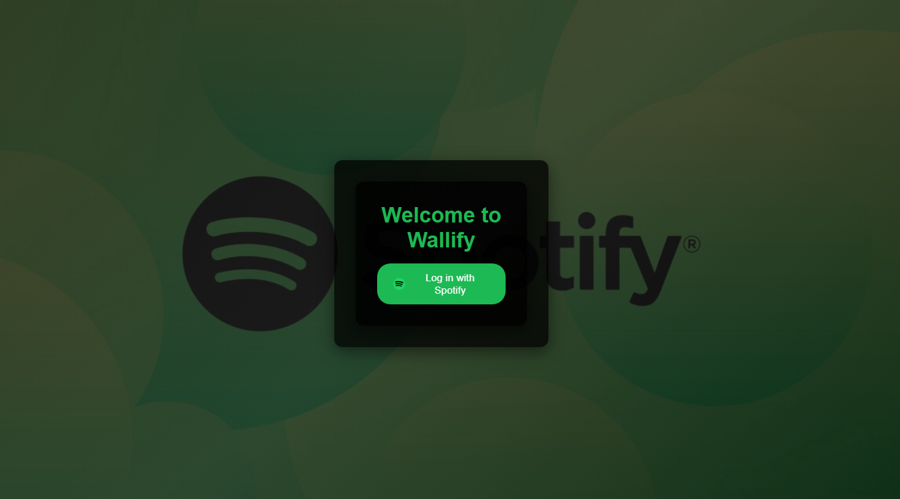
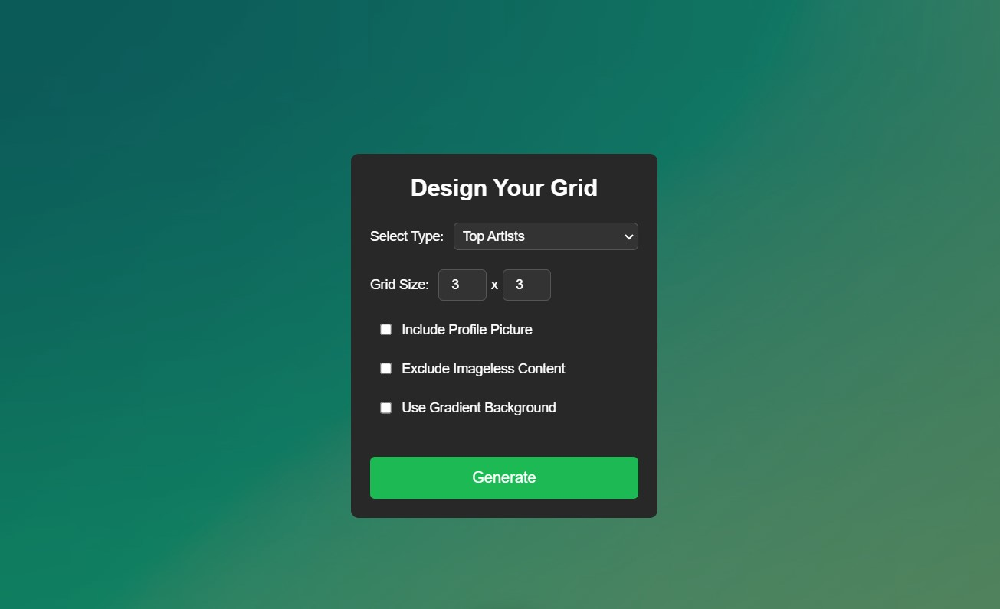
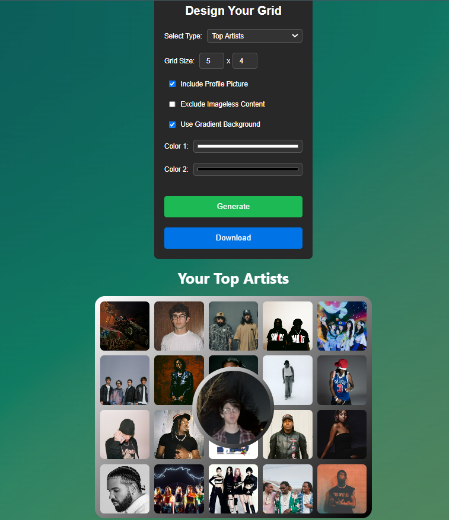

# Wallify

Wallify is a web application built with React and hosted on Vercel, designed to display content from Spotify in the form of a customizable wallpaper. The app uses the Spotify Web API to retrieve user data and provides a highly configurable layout, allowing users to create and download personalized grids of their favorite artists or tracks. It makes use of several services for layered cloud-based architecture, including a custom domain managed by Cloudflare, client site hosting on Vercel, and an EC2 instance for the backend with a secure reverse proxy via NGINX.

*Note: The underlying Spotify app used to handle the Spotify data retrieval is currently in Development Mode. This limits the number of users to 25, each which must be entered into the developer console to be authorized. To make this app work for anyone else, a new Spotify app must be created [here](https://developer.spotify.com/dashboard). I plan to submit an extension request to provide easier access to the wallpapers for a wider audience, but approval may take up to 6 weeks.*

## Table of Contents

- [Features](#features)
- [Architecture](#architecture)
- [Installation](#installation)
- [Available Scripts](#available-scripts)
- [Project Structure](#project-structure)
- [Limitations](#limitations)
- [Contributing](#contributing)

## Features
- **Spotify Data Access:** Users can securely log in with their Spotify account using OAuth. Users are redirected to Spotify's login page to grant permissions and once authenticated, the app retrieves an access token to fetch the user's listening history data
  
  

- **Grid Customization:** Customize the grid layout with adjustable dimensions (X by Y). You can also select colors for the background, apply gradient effects, and even choose to display your Spotify profile picture in the middle of the grid

  

- **Display Top Artists/Tracks:** The application fetches and displays your top artists or tracks from Spotify in a visually customizable grid layout. The number of artists/tracks displayed can be adjusted, and you can choose between top artists or top tracks based on your preference

  

- **Download Feature:** After generating your custom grid, you can download the entire layout as an image using the built-in download button. This makes it easy to save and share your personalized Spotify content

  
  
  

## Architecture
Wallify’s architecture leverages a hybrid cloud stack optimized for performance and scalability. Both the frontend and backend have supporting Docker files for containerization:

- Frontend: Deployed on Vercel for serverless deployment and fast delivery. Built with React, TypeScript, and TailwindCSS
- Backend: Hosted on an AWS EC2 instance, using Go for handling Spotify API authentication and user interactions
- Cloudflare: Domain registrar, DNS, and SSL provider, ensuring secure connections. Manages the domains for https://wallify.doypid.com (the frontend hosted on Vercel) and https://wallify-server.doypid.com (the backend hosted on EC2, reverse-proxied by NGINX)
- NGINX Reverse Proxy: Manages secure routing of backend requests on the EC2 instance, handling HTTPS redirection to the Go server running out of the docker container

## Installation

### Prerequisites
- AWS EC2 Instance - Ubuntu
- Docker (on EC2 instance)
- Cloudflare (custom domain to ensure secure https requests)
- Spotify Developer Account for API keys

1. Clone the repository:
    ```sh
    git clone https://github.com/emw8105/Wallify.git
    cd Wallify
    ```

2. Install the dependencies:
    ```sh
    npm install
    ```

3. Create a .env file with your credentials in the /server directory:
  ```sh
  CLIENT_ID=your_spotify_client_id
  CLIENT_SECRET=your_spotify_client_secret
  REDIRECT_URI=http://yourdomain/callback
   ```

4. Cloudflare Setup:
  - Register a domain with Cloudflare and configure DNS records:
    - A Record for yourdomain.com pointing to Vercel
    - A Record for api.yourdomain.com pointing to your EC2 instance
    - Enable SSL for the domain through Cloudflare
  
5. EC2 Setup:
  - Install Docker, Docker Compose, and NGINX.
  - Configure NGINX as a reverse proxy for https://api.yourdomain.com to route requests to the Go server on port 8888.

6. Run the Deployment Script
  - Deploy the app with the provided bash script:
    ```bash
    ./deploy.sh
    ```

7. Open [http://localhost:3000](http://localhost:3000) to view it in the browser

## Available Scripts

In the project directory, you can run:

- `npm start`: Runs the app in the development mode
- `npm run build`: Builds the app for production to the `build` folder
- `npm test`: Launches the test runner in the interactive watch mode
- `npm run eject`: Removes the single build dependency from your project

## Project Structure
- **README.md**: The main documentation file for the project
- **server.js**: Contains server-side code for handling API requests and serving the React app. This file typically sets up an Express server, defines API endpoints, and serves the static files generated by the React build process. It may also handle authentication and proxy requests to the Spotify API
- **server/**:
  - **.env**: Environment variables file containing the Client ID, Client Secret, and Redirect URL for the server.
  - **deploy.sh**: Deployment script for the server, uses the .pem file to ssh into the EC2 and deploy the generated docker container
  - **Dockerfile**: Docker configuration file for the server
  - **handlers.go**: Contains HTTP handlers for the server
  - **server.go**: Main server file that sets up the HTTP server
  - **spotify.go**: Contains functions for interacting with the Spotify API
  - **token.go**: Manages token generation and validation
  - **users.go**: Manages user-related operations
  - **wallify-dev.pem**: EC2 certificate for establishing an SSH connection for the deployment script
- **src/**: Contains the source code for the React application, including:
  - **App.tsx**: Main App component
  - **components/**: Contains reusable React components
    - **GridDisplay.tsx**: Component for displaying content in a grid layout. This component uses the fetched data from the Spotify API and renders it in a grid format, making it easy to browse through albums, playlists, or tracks
    - **GridItem.tsx**: Component representing each item and storing the corresponding data used in the grid for GridDisplay
    - **Options.tsx**: Component for displaying user options. This component allows users to select different options or settings within the application, such as filtering content or changing display preferences
  - **pages/**:
    - **Login.tsx**: Page for handling user login. This file manages the authentication flow with Spotify, including redirecting users to the Spotify login page and handling the callback to obtain an access token
    - **TopContent.js**: Page for displaying top content from Spotify. This file fetches and displays the user's top tracks, artists, or playlists, providing a personalized experience based on their listening habits
  - **styles/**: Contains CSS and styling files
    - **index.css**: Main CSS file for the application
    - **tailwind.css**: Tailwind CSS file
    - Other file-specific styles

## Limitations
- **Item Display Limit:** Currently, the maximum number of items (artists/tracks) that can be displayed is 99. Requests exceeding this limit are automatically capped, as Spotify only makes the top 99 items available by request
- **Spotify API Rate Limits:** Wallify adheres to the rate limits imposed by Spotify's API, which may impact the speed of content retrieval in cases of high usage. Currently, the project is in Development Mode pending a quota extension request, until then the rate limits are stricter
- **Mixed Content Policy:** To protect users as well as the services built for this application, all requests to backend services must be HTTPS to avoid security issues

## Contributing
Contributions are very much welcome, feel free to add anything or even provide feedback, I would love any facet of collaboration on this.
