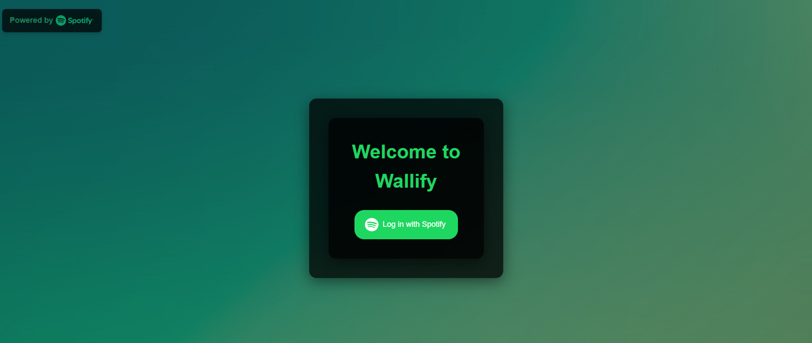

# Wallify

Wallify is a web application built using React that displays content from Spotify in a visually appealing way. This project uses the Spotify Web API to fetch and display user content.

*Note: The underlying Spotify app used to handle the Spotify data retrieval is currently in Development Mode. This limits the number of users to 25, each which must be entered into the developer console to be authorized. To make this app work for anyone else, a new Spotify app must be created [here](https://developer.spotify.com/dashboard). I plan to submit an extension request to provide easier access to the wallpapers for a wider audience, but approval may take up to 6 weeks.*

## Table of Contents

- [Features](#features)
- [Installation](#installation)
- [Usage](#usage)
- [Available Scripts](#available-scripts)
- [Project Structure](#project-structure)
- [Limitations](#limitations)
- [Contributing](#contributing)

## Features
- **Spotify Data Access:** Users can securely log in with their Spotify account using OAuth. Users are redirected to Spotify's login page to grant permissions and once authenticated, the app retrieves an access token to fetch the user's listening history data
  
  

- **Grid Customization:** Customize the grid layout with adjustable dimensions (X by Y). You can also select colors for the background, apply gradient effects, and even choose to display your Spotify profile picture in the middle of the grid.

  

- **Display Top Artists/Tracks:** The application fetches and displays your top artists or tracks from Spotify in a visually customizable grid layout. The number of artists/tracks displayed can be adjusted, and you can choose between top artists or top tracks based on your preference.

  

- **Download Feature:** After generating your custom grid, you can download the entire layout as an image using the built-in download button. This makes it easy to save and share your personalized Spotify content.

  
  
  

## Installation

1. Clone the repository:
    ```sh
    git clone https://github.com/emw8105/Wallify.git
    cd Wallify
    ```

2. Install the dependencies:
    ```sh
    npm install
    ```

3. Create a `.env` file in the root directory and add your Spotify API credentials:
    ```env
    CLIENT_ID=your_spotify_client_id
    CLIENT_SECRET=your_spotify_client_secret
    REDIRECT_URI=your_callback_url
    ```

## Usage

1. Start the Spotify app express server:
   ```sh
    node server.js
    ```

2. Start the development server simultaneously (in a different terminal):
    ```sh
    npm start
    ```

3. Open [http://localhost:3000](http://localhost:3000) to view it in the browser.

## Available Scripts

In the project directory, you can run:

- `npm start`: Runs the app in the development mode.
- `npm run build`: Builds the app for production to the `build` folder.
- `npm test`: Launches the test runner in the interactive watch mode.
- `npm run eject`: Removes the single build dependency from your project.

## Project Structure
- **.env**: Environment variables file containing the Client ID, Client Secret, and Redirect URL for the server.
- **README.md**: The main documentation file for the project.
- **server.js**: Contains server-side code for handling API requests and serving the React app. This file typically sets up an Express server, defines API endpoints, and serves the static files generated by the React build process. It may also handle authentication and proxy requests to the Spotify API.
- **src/**: Contains the source code for the React application, including:
    - **GridDisplay.js**: Component for displaying content in a grid layout. This component uses the fetched data from the Spotify API and renders it in a grid format, making it easy to browse through albums, playlists, or tracks.
    - **GridDisplay.css**: Styles for the GridDisplay component.
    - **Login.js**: Component for handling user login. This component manages the authentication flow with Spotify, including redirecting users to the Spotify login page and handling the callback to obtain an access token.
    - **Login.css**: Styles for the Login component.
    - **Options.js**: Component for displaying user options. This component allows users to select different options or settings within the application, such as filtering content or changing display preferences.
    - **Options.css**: Styles for the Options component.
    - **TopContent.js**: Component for displaying top content from Spotify. This component fetches and displays the user's top tracks, artists, or playlists, providing a personalized experience based on their listening habits.
    - **App.js**: The main React component that serves as the entry point of the application. This component sets up the main structure of the app, including routing and rendering the primary components. It acts as the central hub for the application's functionality.

## Limitations
- **Item Display Limit:** Currently, the maximum number of items (artists/tracks) that can be displayed is 99. Requests exceeding this limit are automatically capped, as Spotify only makes the top 99 items available by request
- **Spotify API Rate Limits:** Wallify adheres to the rate limits imposed by Spotify's API, which may impact the speed of content retrieval in cases of high usage. Currently, the project is in Development Mode pending a quota extension request, until then the rate limits are stricter
- **Profile Picture Quality:** The resolution of the Spotify profile picture may vary based on the image provided by Spotify's API. The quality may not always meet expectations, depending on the original image.

## Contributing
Contributions are very much welcome, feel free to add anything or even provide feedback, I would love any facet of collaboration on this.
